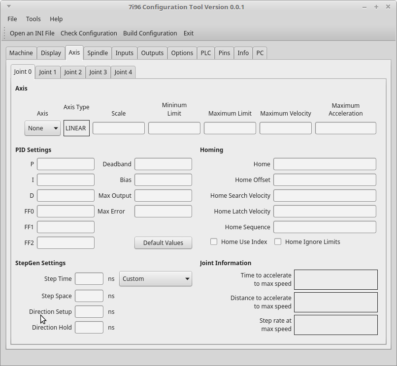

========
Axis Tab
========

Axis Group
----------

Configure each joint by starting with joint 0 and don't skip a joint.

* **Axis** Select the axis letter

* **Scale** Enter the the number of step pulses for one unit (inch or mm)

* **Minimum Limit** Enter the lower number limit in user units

* **Maximum Limit** Enter the higher number limit in user units

* **Maximum Velocity** Enter the maximum velocity in user units per second

* **Maximum Acceleration** Enter the maximum acceleration rate in user units
  per second per second

PID Settings
------------

* **Default Values** populates the PID settings with the default values

StepGen Settings
----------------

* Use the drop down list to select a drive or manualy enter the numbers.

Home Settings
-------------

* **Home** Location of home for that axis

* **Home Offset** The amount of offset from the home switch

* **Home Search Velocity** The speed in user units per second to find the home
  switch

* **Home Latch Velocity** The speed in user units per second to do the final
  move to the home switch.

* **Home Sequence** The order of homing, must start with 0 or 1 and not skip a
  number

* **Home Use Index** If you have an encoder with index you can select this

* **Home Ignore Limits** If you have shared home and limit switches select this

**Joint Information**

* Displays information about that joint after you enter in values in the Axis
  group
