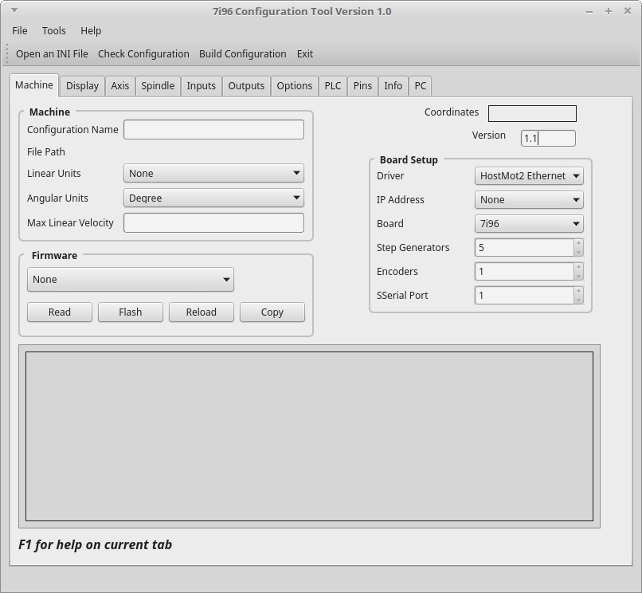

===========
Machine Tab
===========

Machine Group
^^^^^^^^^^^^^

The `Machine Group` contains overall configuration information for the machine.

* **Configuration Name** can be any combination of letters and digits including the \
  dash, underscore and space. Spaces are replaced with an underscore.

* **File Path** displays the actual path to the configuration

* **Linear Units** select from Imperal inch or Metric mm units

* **Angular Units** default is Degree... nothing else is used at this time.

* **Max Linear Velocity** is the maximum linear velocity of all axes combined.
  The maximum linear velocity can be higher than the fastest axis to allow all
  axes to run at their maximum velocity.

Firmware Group
^^^^^^^^^^^^^^

In `Firmware Group` you can view and change the 7i96 firmware. Before using the
`Firmware` buttons you must select the IP Address in the `Board Setup Group`.
The 7i76 must be connected to the PC and 5vdc power supplied.

* **Read** Reads the current firmware and displays it in the output window. If
  sucessful then you have the 7i96 configured and connected correctly.

* **Flash** After selecting the firmware the `Flash` button will write the new
  firmware to the 7i96.

* **Reload** After flashing you must either `Reload` or power cycle the 7i96.

* **Copy** Copies the contents of the output window to the clipboard. Then you
  can paste the output to a file for later use.

Board Setup Group
^^^^^^^^^^^^^^^^^

The `Board Setup Group` contains options for the 7i96 card.

* **Driver** Default is HostMot2 Ethernet

* **IP Address** Select the IP address configured on the 7i96.

* **Step Generators** For future use

* **Encoders** For future use

* **SSerial Port** For future use

Misc.

* **Version** should be 1.1 or higher, it is used by the LinuxCNC conversion script.

* **Coordinates** displays the coordinates that are configured in the Axis tab.

